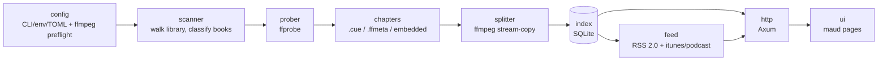
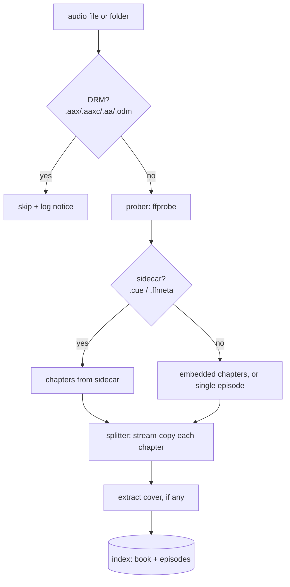

# Architecture

How Podspine turns a folder of audiobooks into per-chapter podcast feeds, and the
invariants that keep those feeds correct and the server safe.

## Overview

Podspine is a single Rust binary built as a Cargo workspace — one crate per
pipeline stage. It shells out to `ffmpeg`/`ffprobe` as separate processes (a GPL
boundary; always invoked with an argument vector, never a shell string) and keeps
its own state in a SQLite index plus a flat directory of split episode files.

At startup it resolves configuration, scans the library once (splitting each book
into per-chapter files and recording them in the index), then serves feeds, audio,
and a small browse UI over HTTP.



## Crates

| Crate | Responsibility |
|---|---|
| `config` | Resolve settings from CLI flags → env → TOML (in that precedence); preflight `ffmpeg`/`ffprobe` so a missing toolchain fails at startup, not mid-request. |
| `scanner` | Walk the library, classify each book (single audio file, per-book subfolder, or multi-track MP3 folder), and orchestrate probe → chapters → split → cover → index. Assigns collision-free slugs; one bad book never aborts the scan. |
| `prober` | Thin `ffprobe` wrapper → `ProbedBook` (duration, audio codec, cover presence/codec, track/title tags, embedded chapters). Parsing is separated from the subprocess call so it's unit-testable. |
| `chapters` | Resolve the chapter source: a sibling `.cue` (75 fps `INDEX 01`) or `.ffmeta` sidecar wins over embedded markers (priority `.cue` > `.ffmeta` > embedded). `.opf`/`.nfo`/`.odm` are never chapter sources. |
| `splitter` | `ffmpeg` wrapper: stream-copy each chapter into a codec-matching container (no re-encode). Bounds concurrency with a semaphore and enforces a per-child timeout/kill. Also extracts cover art. |
| `index` | `rusqlite` (bundled SQLite) store for `book`, `episode`, and `feed_token` rows, with idempotent upserts keyed on stable ids. |
| `feed` | Build one RSS 2.0 channel (itunes + podcast namespaces) per book, and a self-check that refuses to serve a malformed feed. |
| `http` | Axum router: UI, feed, cover, and Range audio routes, plus the security/DoS middleware. |
| `ui` | `maud` server-rendered pages (book grid, per-book copy-URL + QR, how-to panel). Pure presentation — no DB or HTTP dependency. |

Plus the `podspine` server binary (`src/main.rs`, wiring config → scan → serve) and
a `podspine-cli` proof-of-concept for the single-file split pipeline.

## Ingest data flow

Per book, the scanner runs:



- **Single-file books** (`.m4b`/`.m4a`, `.mp3`, `.ogg`/`.opus`/`.flac`) are split by
  chapter via stream copy into a container matching the source codec
  (`m4a`/`mp3`/`flac`/`ogg`/`opus`).
- **MP3 folders** (per-chapter tracks) are treated as one episode per file, ordered
  by track number (falling back to filename order) and **byte-copied** into the
  data dir — no re-split, no re-encode.
- A book with no chapters and no sidecar degrades to a single-episode feed with a
  warning.

## Storage model

SQLite index + flat filesystem. Split episodes are pre-materialized at ingest (v1):

```
<data_dir>/
├── podspine.db              # SQLite index (book, episode, feed_token)
└── books/
    └── <slug>/
        ├── 001.m4a          # per-chapter episode files (NNN.<ext>)
        ├── 002.m4a
        ├── ...
        └── cover.jpg        # extracted cover, if present
```

Everything the HTTP layer serves lives under `<data_dir>` — a single trusted root
that the path-safety check enforces. `book` and `episode` rows carry the on-disk
`file_path` written at scan time; the server never builds a path from request input.

## HTTP surface

Routes split into two surfaces. The **browse UI** is keyed by the human `slug` and
enumerates the library, so it's meant for the LAN / behind proxy-auth. The
**capability surface** is keyed by a random, unguessable per-book `feed_id` and is
safe to expose externally (a guessed id 404s); see
[DEPLOYMENT.md](DEPLOYMENT.md#exposing-podspine-safely).

| Route | Surface | Purpose |
|---|---|---|
| `GET /` | UI (slug) | Browsable book grid. |
| `GET /book/{slug}` | UI (slug) | Per-book page: copy capability-feed-URL, QR code, per-app how-to, **Regenerate link**. |
| `POST /book/{slug}/regenerate` | UI (slug) | Rotate the book's `feed_id` (leak recovery); same-origin/CSRF-guarded. |
| `GET /feed/{feed_id}.xml` | capability | The podcast feed (built from the index, passed through the self-check); always `itunes:block` + `X-Robots-Tag: noindex`. |
| `GET /audio/{feed_id}/{n}` | capability | Episode audio with HTTP Range (206 / `Content-Range` / 416) via `axum-range`. |
| `GET /cover/{feed_id}` | capability | Book cover image. |
| `GET /healthz` | — | Liveness. |

## Invariants

These are the rules the whole design exists to protect — the reasons the crates are
split the way they are.

**Feed correctness (the bug that killed predecessors):**
- `pubDate`s are strictly sequential with **oldest = chapter 1**, so episodes play
  in order.
- Every item carries `itunes:episode`, `itunes:duration` (`HH:MM:SS`), and an
  `enclosure length` read from the **real output file** (never prorated from a
  bitrate).
- `guid = blake3(book.id : idx : source_mtime)` — stable across re-scans of an
  unchanged source, and changes only when the source changes.
- A generated feed is rejected by the self-check before it can be served if any of
  the above is violated.

**Audio fidelity:**
- Copy-first: chapters are split by stream copy, no re-encode, so there's no quality
  loss.

**Security (see [SECURITY.md](../SECURITY.md) for the threat model):**
- Book/episode ids are **opaque index keys**. Slugs are validated against an
  allow-list charset and rejected with 404; the resolved audio path is canonicalized
  and asserted to stay under `<data_dir>`. A path is never built from user input.
- `ffmpeg`/`ffprobe` are invoked with an **argv vector, never a shell string** —
  chapter titles and filenames are untrusted.
- Bounded `ffmpeg` concurrency (a semaphore sized to the CPU count) with a per-child
  timeout and kill; the HTTP layer adds concurrency, timeout, and body-size limits.
- **DRM-free input only.** DRM-protected files are skipped with a logged notice;
  Podspine ships no circumvention, and `ffmpeg` stays out-of-process (GPL boundary).

## See also

- [DEVELOPMENT.md](DEVELOPMENT.md) — building, testing, and the crate layout in practice.
- [DEPLOYMENT.md](DEPLOYMENT.md) — running it in production (Docker, reverse proxy, systemd).
- [../CONTRIBUTING.md](../CONTRIBUTING.md) — contribution workflow.
